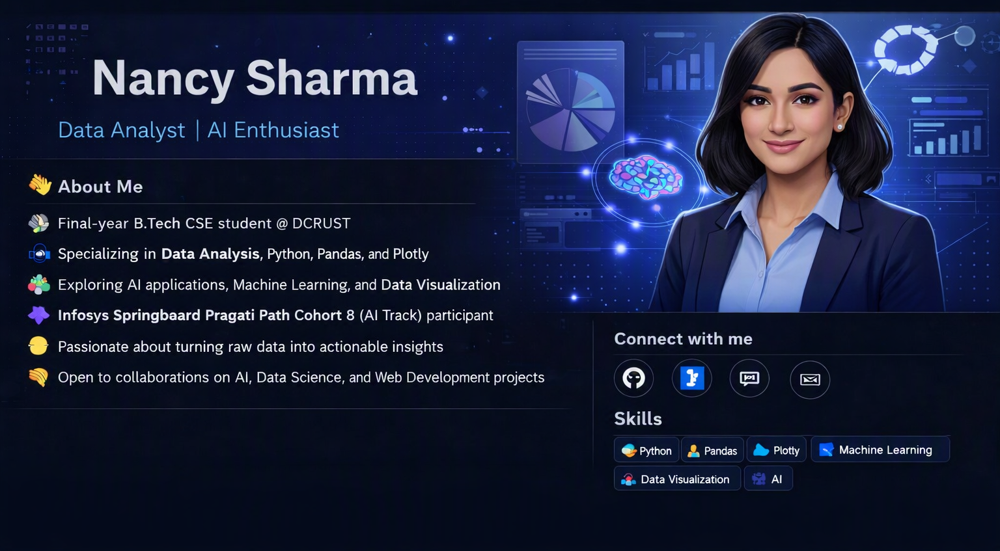

  

<h1 align="center">Hi 👋, I'm Nancy Sharma</h1>
<h3 align="center">Data Analyst | AI Enthusiast | B.Tech CSE @ DCRUST</h3>

  
  
  

---

### 👩‍💻 About Me
🎓 Final-year **B.Tech CSE student** at **Deenbandhu Chhotu Ram University of Science & Technology (DCRUST)**  
📊 Passionate about **Data Analysis, AI, and Machine Learning**  
🤖 Currently exploring **Python, Pandas, Plotly, and AI-driven insights**  
💡 Love transforming **raw data into meaningful stories**  
🤝 Open to **collaborations, internships, and research** in AI/Data Science  

---

### 🧠 Tech Stack
**Languages:** Python, SQL, JavaScript  
**Data & Visualization:** Pandas, NumPy, Matplotlib, Plotly  
**Machine Learning:** Scikit-learn, TensorFlow, PyTorch  
**Web & Tools:** Streamlit, Flask, Git, REST APIs  
**Cloud:** Google Cloud, Oracle Cloud Infrastructure  

---

### 🚀 Featured Projects
- 🧩 **AI-Powered Data Dashboard** – Interactive analytics using Plotly & Streamlit  
- 🤖 **Predictive Model for Sales Forecasting** – ML regression pipeline  
- 📊 **Data Visualization Suite** – Dynamic charts and dashboards for insights  

---

### 📈 Current Focus
- Building **end-to-end data pipelines**  
- Exploring **AI applications in business intelligence**  
- Enhancing **data storytelling and visualization** skills  

---

### 🌟 Fun Fact
I turn **complex datasets into clear, actionable insights** that drive smarter decisions!

---

### 📫 Connect With Me

  
  
  

